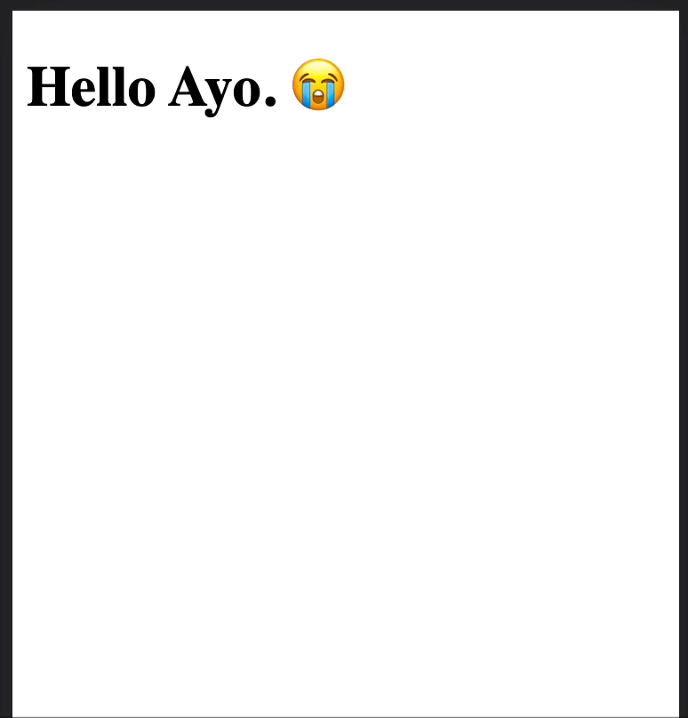

# Web Component Base Class

This is a base JavaScript class for creating Web Components easily.

## Installation

```bash
npm i web-component-base
```

## Usage

When you extend the 'WebComponent' class for your component, you only have to define the `template()` and `observedAttributes()`, and the UI will be reactive on attribute changes.

```js
// HelloWorld.mjs
import { WebComponent } from "./WebComponent.mjs";

export class HelloWorld extends WebComponent {
  name = "World";
  emotion = "excited";

  static get observedAttributes() {
    return ["name", "emotion"];
  }

  get template() {
    return `
        <h1>Hello ${this.name}${this.emotion === "sad" ? ". 😭" : "! 🙌"}</h1>`;
  }
}
```

Then changes in the attributes observed will cause the UI to render.

```html
<head>
  ...
  <script type="module">
    import {HelloWorld} from './HelloWorld.mjs';
    customElements.define('hello-world', HelloWorld);
  </script>
</head>
<body>
  <hello-world name="Ayo" emotion="sad">
  <script>
      const helloWorld = document.querySelector('hello-world');
      setTimeout(() => {
        helloWorld.setAttribute('emotion', 'excited');
      }, 2500)
  </script>
</body>
```


